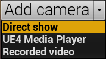

# Connect cameras

## Add cameras

Connect at least 2 cameras to your PC.  
Click `Add camera` button at the top of the MocapForAll window.  
Select the combo box next to `Camera:` to find the connected camera.  

{ loading=lazy }

- You can change the image size of the camera by entering the dimensions and clicking `Apply` if camera supports the specified image size.

    !!! Warning "If it fails to change image size"
        Somtimes it fails to change the image size. In that case, please close camera, wait for a moment, and try again.

- You can flip the image horizontally.

    !!! Warning "Flip image if necessary"
        Some cameras have a mirror image by default. If the image is a mirror image, the AR marker cannot be read.

- You can rotate the image. 

    !!! Warning "Rotate camera properly"
        At the start of capture, only a person standing upright can be recognized. So, rotate the image appropriately according to the actual orientation of the camera.

## Select camera control framework
You can select the framework to control the camera by pressing the `▼` next to `Add camera` at the top of the MocapForAll window.    

{ loading=lazy }

- **Direct show:** Microsoft's media framework. You can use the OBS-VirtualCam plugin with this.
- **UE4 media player:** UE4's media framework. Better performance at high resolution. Some cameras don't work with this.
- **Recorded video**: Use recorded video instead of camera. See [Motion capture from recorded videos](../../../other-settings/capture-from-recorded-video).

If the camera works with UE4 media player, it is recommended to use it. If it doesn't work, use Direct Show.