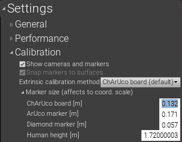

# Prepare markers

In order to calibrate a camera, it is necessary to "find the positions of points in the camera image whose positions in the real world are known". To do that, you need to take pictures of the "specific images" described below with the camera that actually you are using, so that the application can calculate the before-mentioned camera information from the pictures.  

In this section, we will print the "specific images" in preparation for camera calibration.

## Print marker for intrinsic parameter calibration

We will use [this image](https://raw.githubusercontent.com/Akiya-Research-Institute/MocapForAll-Wiki/main/resources/calibration/IntrinsicCalibration.png).  
If you haven't fixed the camera in the room yet, you don't need to print it out. We will use the above image by showing on the PC display.  
If you have already fixed the camera, print the above image in A4 size. The size does not have to be exact. Then tape it to a cardboard box to keep it flat.  
{ loading=lazy }

## Print marker for extrinsic parameter calibration

The image differs depending on the [4 methods to get extrinsic parameters](../what-is-camera-calibration/#4-methods-to-get-extrinsic-parameters) explained before.

Either way, the size does not have to be exact.

=== "ChArUco board method"
    We will use [this image](https://raw.githubusercontent.com/Akiya-Research-Institute/MocapForAll-Wiki/main/resources/calibration/ExtrinsicCalibration.png). Print this in **A2 or larger**.  
    You don't have a printer which can print A2? Then, it is recommended to divide the image into two pieces, print them on two sheets of A3 paper, and tape them together.  
    { loading=lazy }  
    If you tape it on a cardboard like this so that it keeps in a clean flat state, you can continue to use it for a long time.  
    （The one in the photo above has been used for about 3 months, but it is still good to use.)

=== "ArUco cluster method"
    We will use `arucoMarker0.png`, `(same)1.png` and `(same)2.png` in [this zip](https://github.com/Akiya-Research-Institute/MocapForAll-Wiki/raw/main/resources/calibration/ArucoMarkers.zip).  
    Print them in A4 or A3. A4 is enough for a room that is not very large.   
    { loading=lazy }  

=== "Diamond cluster method"
    We will use `diamondMarker0.png` and others in [this zip](https://github.com/Akiya-Research-Institute/MocapForAll-Wiki/raw/main/resources/calibration/DiamondMarkers.zip).  
    Print them in A2 or larger in the same way as "ChArUco board method".  
    { loading=lazy }  

=== "Human motion method" 
    There is nothing to print.

## Measure the marker size

You need to measure the size of the actual printed image for extrinsic parameter calibration. The measured values will be used to define the scale of the captured movement.  
The part to measure differs depending on the [4 methods to get extrinsic parameters](../what-is-camera-calibration/#4-methods-to-get-extrinsic-parameters) explained before.

=== "ChArUco board method"
    .png){ loading=lazy }   
    Put the value in **`Settings > Calibration > Maker size (affects to coord. scale) > ChArUco board [m]`**. The unit is meters.  
    { loading=lazy }   

=== "ArUco cluster method"
    { loading=lazy }  
    Put the value in **`Settings > Calibration > Maker size (affects to coord. scale) > ArUco marker [m]`**. The unit is meters.  
    { loading=lazy }   
    
=== "Diamond cluster method"
    { loading=lazy }  
    Put the value in **`Settings > Calibration > Maker size (affects to coord. scale) > Diamond marker [m]`**. The unit is meters.  
    { loading=lazy }   
    
=== "Human motion method" 
    Measure the height of your body.  
    Put the value in **`Settings > Calibration > Maker size (affects to coord. scale) > Human hight [m]`**. The unit is meters.  
       

