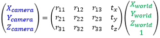

# What is camera calibration?

Camera calibration is the process of obtaining information about the relationship between **the positions in the camera image and the positions in the real world**. This page describes the concept of what you are doing with camera calibration and some tips for it.

MocapForAll obtains the following 2 types of information during camera calibration:

- Intrinsic parameters (Characteristics of the camera itself)
- Extrinsic parameters (Position of the camera in the real world)

## What is intrinsic parameters?

Intrinsic parameters are the focal length *f* of the lens and the position of the optical axis *Cx, Cy*, which describes the **characteristics of the camera itself**.  
These are unique to the camera (lens) and basically do not change over time. Therefore, **once you get them correctly, you don't need to get them again.**  

!!! Warning "Notes on autofocus"
    If you use a camera with autofocus, keep in mind that as the focus changes, the focal length changes, so the intrinsic parameter also changes.  
    In our experiences, it does not cause much problems when using regular webcams or mobile phones, but if high accuracy is not obtained, you might need to disable autofocus.  

!!! Question "Mathematical representation"
    Mathematically, it is represented by a matrix that describes the relationship between "positions in the camera image" and "positions in the camera coordinate". This is the matrix displayed on the app screen.  

    { loading=lazy }  

    { loading=lazy }

## What is extrinsic parameters?

Extrinsic parameters are **the position and the orientation of the camera in the real world**.  
In theory, once the camera is completely fixed in your room, it can be treated as a fixed value. But in practice, it sometimes shifts little by little over time. So, **it is recommended to obtain it again every time you start using MocapForAll**.   

!!! Question "Mathematical representation"
    Mathematically, it is represented by a matrix that describes the relationship between "positions in the camera coordinate" and "positions in the world coordinate". This is the matrix displayed on the app screen.

    { loading=lazy }  

    { loading=lazy }

## 4 methods to get extrinsic parameters
In MocapForAll, there are 4 methods to get extrinsic parameters. Please note that the preparation and execution procedures are different for each as described later.

|  Method  |  Accuracy  |  Ease of preparation  |  The size of the usable space  | 　Comment  |
| ---- | ---- | ---- | ---- | ---- |
| 1. Method using ChArUco board |  👍👍👍  |  👍  |  👍  | The most accurate, but requires a little work to prepare. **I think this is the easiest way in the long run.** |
|  2. Method using ArUco cluster  |  👍👍  |  👍👍  |  👍👍  | This is a method with good accuracy and easy preparation. **For beginners, I recommend that you try this method first.** |
| 3. Method using Diamond cluster |  👍👍👍  |  💀  |  👍👍👍  | This method allows capturing in a large space with many cameras by measuring the relative positions of multiple markers, though it takes time to prepare. |
|  4. Method using human motion  |  👍  |  👍👍👍  |  👍👍  | This method allows capturing in an environment where the marker cannot be printed or placed (for example, outdoors). |
