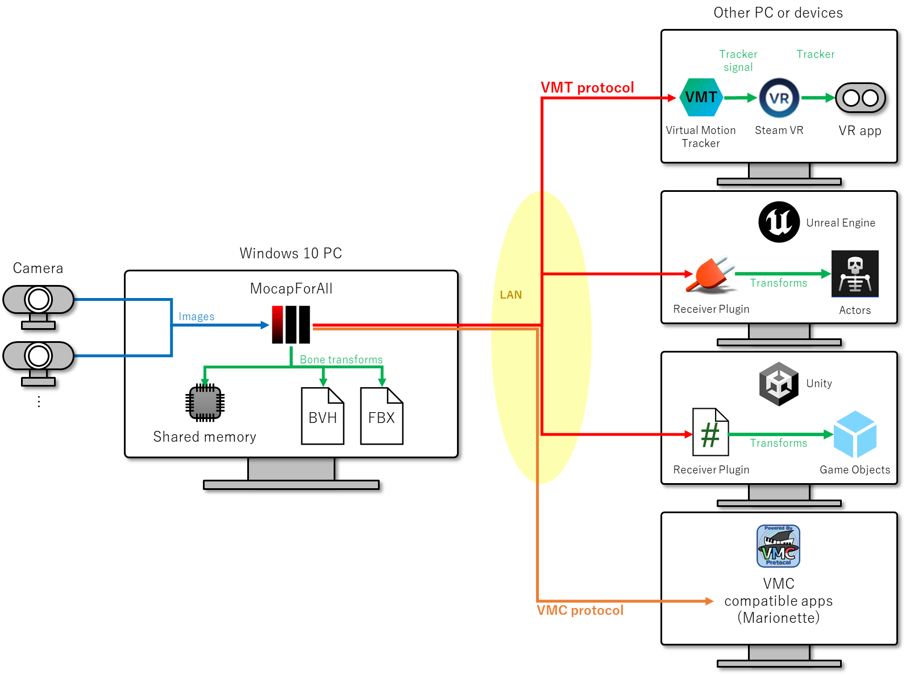

# What is MocapForAll?

## Motion capture software for everyone

{ loading=lazy }

### No special equipment required

You can capture human motion if you have the followings:

- a middle range PC
- 2 or more webcams
- a room of about 2.5m x 2.5m

You can use regular webcams like the ones used in video conferences. You can also use apps that turns your smartphones or tablets into webcams.

### Realtime with a middle range PC

For examples, it runs at 

- around 17 fps on Surface Pro 7 which does not have a dedicated GPU
- 30 to 60 fps on GTX 1080 Ti

### Cheap

An option for projects with limited budgets, such as indie games, indie films, or education.

## What you can do with MocapForAll

- You can output captured motion to the network(\*1) via VMT protocol(\*2) and [VMC protocol](https://protocol.vmc.info/english)(\*3) in real time. 
- You can save the captured motion to files in BVH format and FBX format.
- You can output captured motion to the shared memory in real time.

{ loading=lazy }

!!! Note
    (\*1) Both VMT protocol and VMC protocol use UDP/OpenSound Control.

    (\*2) "VMT protocol" here refers to the [message format](https://gpsnmeajp.github.io/VirtualMotionTrackerDocument/api/#osc-protocol-osc) used in the communication of [Virtual Motion Tracker](https://gpsnmeajp.github.io/VirtualMotionTrackerDocument/). The official HP of Virtual Motion Tracker does not use the word "VMT protocol", but MocapForAll uses the word "VMT protocol" for convenience.  

    (\*3) "VMC protocol" is a message format used for communication between applications such as [VirtualMotionCapture](https://vmc.info/). Note that VirtualMotionCapture itself is not required for other compatible apps to communicate with each other using VMC protocol.

These allow you to do the followings:

### Use in SteamVR via Virtual Motion Tracker

Through [Virtual Motion Tracker](https://gpsnmeajp.github.io/VirtualMotionTrackerDocument/), the capture motion can be used as virtual trackers in applications running on SteamVR.

### Use in Unreal Engine4, Unreal Engine5, Unity

You can send the captured motion to Unreal Engine4, Unreal Engine5, or Unity for game development or video production.  

- Plugins for linking data directly to UE4, UE5, or Unity are available [here](https://booth.pm/ja/items/3026430).  
- As described in [Use in other apps via VMC protocol](#use-in-other-apps-via-vmc-protocol), it is also possible to link by EVMC4U and VMC4UE using VMC Protocol.
- A Unity sample to read data from the shared memory written by MocapForAll is available [here](https://github.com/Akiya-Research-Institute/MocapForAll-SharedMemory-Plugin-for-Unity).

### Use in other apps via VMC protocol

You can send the captured motion to various applications via the VMC protocol. The following are confirmed to work:

- Sending bones and facial expression morphs to Unity using [EVMC4U](https://github.com/gpsnmeajp/EasyVirtualMotionCaptureForUnity)
- Sending bones and facial expression morphs to Unreal Engine using [VMC4UE](https://github.com/HAL9HARUKU/VMC4UE)
- Sending bones to Blender using [VMC4B](https://tonimono.booth.pm/items/3432915)
- Sending bones to [VSeeFace](https://www.vseeface.icu/), and receiving facial expression morphs from VSeeFace
- Sending tracker to [VirtualMotionCapture](https://vmc.info/)

### Save animations to files

You can save the captured motion as BVH files and FBX files. It can be used with Blender etc.

### Create programs to receive data

As the output specifications are open to public (except for FBX), you can even create your own programs to receive data from MocapForAll.