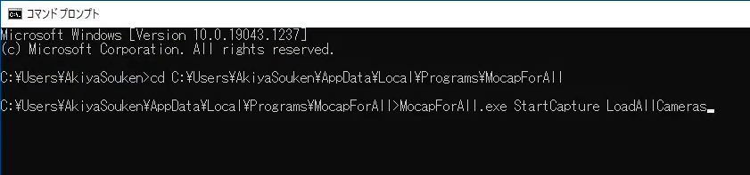

# Others

## Lock-on to the character

- Turn on `Settings > General > Look at character` to make the view follow the movement of the character.

## Display the tracking positions

- Turn on `Settings > General > Draw tracking points` to show the yellowish cubes to display the tracking positions.

## Language

- You can change the language from the earth icon on the upper right corner of the window. Currently, Japanese, English, and French are supported.

## Reset all the settings

Delete `C:\Users\\[User name]\AppData\Local\MocapForAll` to reset all the settings

If MocapForAll does not launch for some reason, resetting the settings may solve the problem.

## Execute some actions at startup by command line arguments

From v1.13, you can execute a specific operation at startup by specifying the following phrase in the arguments. 

- `StartCapture`:  Execute the same process as `Start Capture` button is pressed immediately after startup.
- `LoadAllCameras`: Execute the same process as `Load All Cameras` button is pressed immediately after startup.

Example:

{ loading=lazy }

## Apply motion only to the upper body

With the following settings, the motion will be applied only to the upper body of the character.  
- Turn off `Settings > General > Capture body > Apply to lower body`.

The lower body stops at the position of the last frame, so adjust the relative position of the upper and lower body with `Settings> Coordinates` if necessary.  
