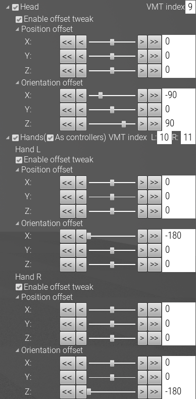

# Use as dummy HMD and controllers

!!! Warning "Experimental feature"
    You are using an experimental feature. Do not expect it to *work*.

1. Disconnect all VR devices.
2. Open `C:\Program Files (x86)\Steam\config\steamvr.vrsettings` .
3. Add the following lines:

    ```
       "TrackingOverrides" : {
          "/devices/vmt/VMT_9" : "/user/head"
       },
       "driver_null" : {
          "enable" : true,
          "id" : "Null Driver",
          "windowHeight" : 1080,
          "windowWidth" : 1920,
          "windowX" : 100,
          "windowY" : 100
       },
    ```

    See [VMT manual](https://gpsnmeajp.github.io/VirtualMotionTrackerDocument/api/#tracking-override) for details of "TrackingOverrides" settings.

4. Start SteamVR.
5. Start MocapForAll and turn on export settings for VMT protocol.
6. Set Orientation offsets for head and hands.

    { loading=lazy }

7. Start capture.

If you want to use buttons on controller, use VMTManager  
or try programs below. (You need to build them from source code.)  
[VMT-RemoteController](https://github.com/KenjiAsaba/VMT-RemoteController)  
[Modified VMT - AddJoystickTouchAndClick branch](https://github.com/KenjiAsaba/VirtualMotionTracker/tree/AddJoystickTouchAndClick)

