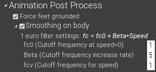

# 動きの加工の調整

{ loading=lazy }  

キャプチャされた動きは、下記の加工がされたうえで画面に表示されます。好みに応じてそれらの調整を行います。　

## 足の強制接地

足が地面にめり込んだり、地面から浮いたりしてしまわないよう、足が地面の近くにある場合はその位置を自動的に調整する機能があります。

- **足の接地感を重視**する場合は、「Settings > Animation Post Process > Force feet grouded」を**オン**にして上記機能を使用することをおすすめします。
- **脚全体の動きを重視**する場合は、「Settings > Animation Post Process > Force feet grouded」を**オフ**にして上記機能を使用しないことをおすすめします。

!!! Info "VRユーザはスキップ可能です"
    「Settings > Data export > VMT protocol > Send tracking points」をオンにしたときに送信されるデータは、上記の位置調整が適用される前のものです。（つまり、**VMTでVRアプリと組み合わせて使用する場合は、ここでの設定は関係ありません**）
    上記以外の外部送信データは、上記の位置調整が適用された後のものです。

!!! Failure "足が地面にくっつてしまう場合"
    足がどれくらい地面に近い場合にこの位置調整が適用されるかは、「Settings > Coordinates > Scale > Lower body」に応じて自動的に設定されます。
    [マーカのサイズの計測](../../calibrate-cameras/prepare-markers/#_4)が適切に行われず、上記「Lower body」に大きな値を設定してしまっていると、足が全く地面から離れなくなることがあります。その場合は、[マーカのサイズの計測](../../calibrate-cameras/prepare-markers/#_4)と[外部パラメータの取得](../../calibrate-cameras/execute-calibration/#_3)を再度実施するか、「Force feet grouded」をオフにしてください。

## スムージングの調整

キャプチャした動きを、時系列に沿ってスムージングする機能があります。  
外部送信できる各種データは、全てこのスムージングが適用された後のものです。

### スムージングのオンオフ

通常オンの状態で使用しますが、キャプチャ結果を利用するアプリケーションで独自にスムージングを行う場合は、MocapForAll側でのスムージングをオフにすることがあります。  
「Settings > Animation Post Process > Smoothing on body」および「Smoothing on finger」「Smoothing on facial expression」で、体、指、表情へのスムージングのオンオフを設定できます。

### スムージング強度の調整方法

- キャプチャを開始し、まず、体を動かさずまっすぐ立った時のノイズを観察します。ノイズが気になる場合は、***fc0***を減らします。
- ノイズが十分抑えられたら、次に、キャプチャ目的に応じた適当な速さで体を動かします。動きに追随できていない場合は、***Beta***を増やします。

!!! Question "スムージングのしくみ"

    スムージングには[1€フィルタ](http://cristal.univ-lille.fr/~casiez/1euro/)を使用しています。1€フィルタとは、端的に表現すると「速さに比例してカットオフ周波数が増加するローパスフィルタ」です。通常のローパスフィルタは、ノイズを抑えようとすると機敏な動きへ追随することができなくなってしまいますが、1€フィルタでは、**機敏な動きに対してはノイズ抑制を緩くしてやることで、低速でのノイズを抑えつつ機敏な動きへの追従性も確保する**ことができます。

    下記の3つの項目を調整することができます。

    - fc0: 速さゼロにおけるカットオフ周波数。**これが小さな値であるほど、低速でのノイズが抑制されます**。
    - Beta: 速さに比例してカットオフ周波数がどれだけ増加するか。**これが大きな値であるほど、機敏な動きに追随できます**。
    - fcv: 速さに対するカットオフ周波数。速さに対しては、この値で指定されるカットオフ周波数を持つ通常のローパスフィルタが適用されます。