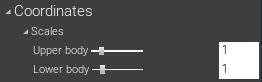

# スケールの調整

{ loading=lazy }

ウィンドウ上部の「Start capture」をクリックし、二つ以上のカメラに全身を映すと、モーションがキャプチャされます。  
キャプチャ結果を観察し、下記の通りスケールを適切に調整することで、キャラクターに動きが正しく反映されるようにしていきます。　

!!! Info "VRユーザはスキップ可能です"
    Virtual Motion TrackerおよびVRアプリと組み合わせて使用する場合は、後述の[SteamVRとMocapForAllの座標合わせ](../../../how-to-export/to-steamvr/#steamvrmocapforall)でスケールも併せて調整するので、ここでの調整は適当でOKです。

!!! Question "なぜスケールが2つあるのか"
    上半身と下半身でスケールを分けているのは、ゲームのキャラクターは一般に生身の人間より足が長いので、上半身と下半身を分けないと生身の人間のサイズと合わないからです。（そのため、上半身と下半身のスケールの比は適用したいキャラクターに依存します）
    
## 下半身のスケール

腰、股関節、膝、足の位置に影響します。また、体全体の位置（root位置）もこのスケールに従います。

- キャラクターが常にしゃがんでいる場合： 「Settings > Coordinates > Scales > Lower body」の値を増やします。
- キャラクターが宙に浮いている場合： 「Settings > Coordinates > Scales > Lower body」の値を減らします。

## 上半身のスケール

胸、首、頭、肩、肘、手、指の位置に影響します。

- キャラクターの肩が常に下を向いている場合： 「Settings > Coordinates > Scales > Upper body」の値を増やします。
- キャラクターの肩が常に上を向いている場合： 「Settings > Coordinates > Scales > Upper body」の値を減らします。