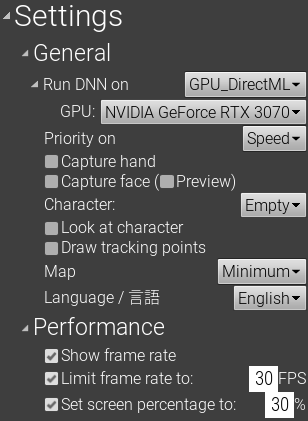

# パフォーマンス最適化

使用するPC環境と用途にあわせて、負荷を下げるよう設定します。

{ loading=lazy }

## フレームレートの確認

「Settings > Performance > Show frame rate」を**オン**にすると、現在のフレームレートがウィンドウ下部に表示されます。 

## GPUの使用

MocapForAllではAIを使って人の姿勢を推定しています。AIの計算は、多くの場合、CPUよりGPUを使う方が高速です。
GPUが搭載されたPCを使っている場合、「Settings > General > Run DNN on」で「**GPU_DriectML**」を選択することを強くおすすめします。

!!! Tip "複数GPUからの選択"
    GPUが複数ある場合は、どのGPUを使うかを「Settings > General > Run DNN on > GPU」で設定できます。

!!! Question "TensorRTを使うべきか"
    GPUを使う場合、「GPU_DriectML」と「GPU_TensorRT」の二つの選択肢があります。  
    TensorRTは環境準備が大変かつ読み込み時間が長く、それでいて見返りが少ないため、多くの場合「**GPU_DriectML**」 の使用をおすすめします。

    - GPU_DriectML:  
      DirectMLは、DirectX12対応GPUでGPUアクセラレーションを可能にします。使用可能なハードウェアの例は次の通りです。
      - NVIDIA Kepler（GTX 600シリーズ）以降
      - AMD GCN 1st Gen（Radeon HD 7000シリーズ）以降

    - GPU_TensorRT:  
      TensorRTは、サポートされているNVIDIA製GPUでGPUアクセラレーションを可能にします。
      これを使用するには、[CUDA、cuDNN、およびTensorRTをインストール](../../../how-to-install/install-tensorrt)した上で、[Appendix4_TensorRT_mode](../../../how-to-install/install-mocapforall/#_6)をインストールする必要があります。

## 速度優先モード

「Settings > General > Capture body」から、何を優先して実行するかを設定できます。

- 多くの用途で「**Speed**」をおすすめします。
- ノートPCなど性能が低いPCを利用している場合や、非常に重いVRアプリと併用する場合などは、「Speed+」をおすすめします。
- 映像用途等で特に精度よくモーションキャプチャしたい場合には、「Precision」モードを使用します。「[Appendix1_Precision_mode](../../../how-to-install/install-mocapforall/#_6)」のインストールが必要です。

## 描画の削減

下記の設定により、MocapForAll上での描画を減らし負荷を削減することができます。

- 「Settings > General > Character」で「**Empty**」キャラクターを選択します。
- 「Settings > General > Map」で「**Minimum**」マップを選択します。
- 「Settings > Performance > Set screen percentage to」を**オン**にし、小さな値 (たとえば 30%) を設定します。  
  または、「Settings > Performance > Render the viewport」を**オフ**にします。

## フレームレート上限の設定

- 「Settings > Performance > Limit framerate to:」を**オン**にし、目標とするフレームレート (たとえば 30FPS) を設定します。 
    MocapForAllはこのフレームレートを上限として動作します。