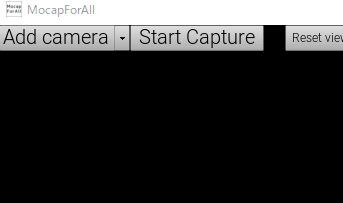
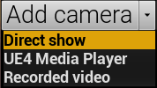

# カメラの接続

## カメラの追加

少なくとも2台のカメラをPCに接続します。  
MocapForAllのウィンドウ上部の「Add camera」ボタンを使用するカメラの数だけクリックします。  
「Camera:」の横のプルダウンボックスを選択し、接続したカメラを探します。   

{ loading=lazy }

- 「Image size」横のボックスにサイズを入力し「Apply」をクリックすると、カメラの画像サイズを変更できます。  

    !!! Warning "画像サイズ変更に失敗する場合"
        - カメラの画像サイズの変更に失敗することがありますが、その場合はカメラを閉じてから少し待って、再度お試しください。
        - カメラが指定された画像サイズをサポートしている必要があります。

- 画像の左右反転ができます。

    !!! Warning "鏡像では機能しません"
        一部のカメラはデフォルトで画像が鏡像になっていることに注意してください。画像が鏡像になっているとARマーカが読み込めません。

- 画像の回転ができます。

    !!! Warning "適切な向きにしてください"
        キャプチャ開始時点は人が真っすぐ立っている画像でなければ認識できないので、カメラの設置状況に合わせて画像を適切に回転しておいてください。

## カメラ制御フレームワークの選択

MocapForAllのウィンドウ上部の「Add camera」の横の「▼」を押すと、カメラの制御に使うフレームワークを選択できます。    

{ loading=lazy }

- **Direct show:** Microsoftのメディアフレームワーク。OBS-VirtualCamプラグインが使えます。
- **UE4 media player:** UE4のメディアフレームワーク。高解像度での性能に優れています。一部のカメラは動作しないようです。
- **Recorded video**: カメラの代わりに録画済みの動画を使用します。詳細は、[録画した動画からモーションキャプチャする](../../../other-settings/capture-from-recorded-video)を参照してください。

UE4 media playerで動作するカメラならば、そちらがおすすめです。動作しない場合はDirect Showを使いましょう。