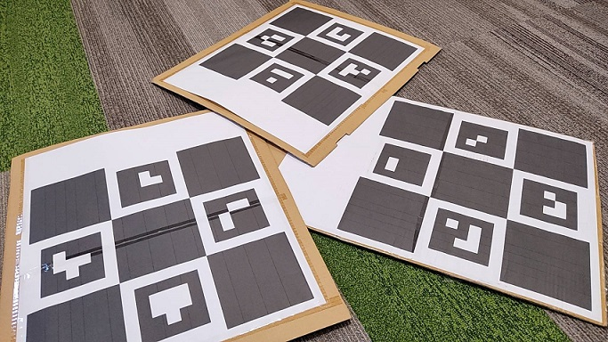
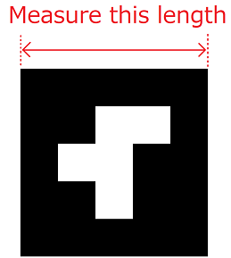
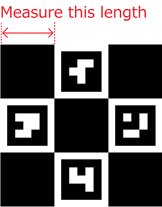

# マーカの準備

カメラ校正を行うためには、「位置がわかっている現実世界の座標がカメラ画像上でどこにあるか」を知る必要があります。そこで、下記に述べる「特定の画像」を実際に使うカメラで撮影してもらい、その撮影結果から上述のカメラの情報をアプリ側で算出する、ということを行います。  

この節では、カメラ校正の準備として、これらの画像を印刷していきます。

## 内部パラメータの取得で使う画像の印刷

[この画像](https://raw.githubusercontent.com/Akiya-Research-Institute/MocapForAll-Wiki/main/resources/calibration/IntrinsicCalibration.png)を使います。  
まだカメラを部屋の中で固定していない場合は、印刷は不要です。この画像をPCのディスプレイに表示して使います。  
すでにカメラを固定済みの場合は、上記の画像をA4程度の大きさで印刷してください。大きさは厳密である必要はありません。ダンボールなどに貼り付けて平面の状態を保てるようにしておいてください。  
{ loading=lazy }

## 外部パラメータの取得で使う画像の印刷

先に説明した[外部パラメータの取得の4つの方式](../what-is-camera-calibration/#4)により、使用する画像が異なります。

=== "ChArUcoボードを使うやり方 "

    [この画像](https://raw.githubusercontent.com/Akiya-Research-Institute/MocapForAll-Wiki/main/resources/calibration/ExtrinsicCalibration.png)を使います。これを**できればA2以上**のサイズで印刷してください。  
    「A2で印刷できるプリンタがない！」という場合、画像を二つにわけてA3用紙2枚に印刷し、テープでくっつけるのがおすすめです。  
    
    { loading=lazy }  

    このようにダンボールなどに貼り付け、きれいな平面の状態を保てるようにしておくと、後々まで使い続けることができます。  
    （上の写真のものは3か月ほど使い込んでいますが、現役です)

=== "ArUcoクラスターを使うやり方"
    [このzip](https://github.com/Akiya-Research-Institute/MocapForAll-Wiki/raw/main/resources/calibration/ArucoMarkers.zip)にある"ArucoMarker0.png"と"同1"、"同2"を使います。これをA4かA3サイズで印刷してください。それほど広くない部屋ならA4で十分です。

    { loading=lazy }  

=== "Diamondクラスターを使うやり方"
    [このzip](https://github.com/Akiya-Research-Institute/MocapForAll-Wiki/raw/main/resources/calibration/DiamondMarkers.zip)にある"diamondMarker0.png"およびそれ以降を使います。「1.ChArUcoボードを使うやり方」と同様に、A2以上のサイズで印刷してください。

    { loading=lazy }  

=== "人の動きを使うやり方" 
    特に準備するものはありません。

## マーカのサイズの計測

外部パラメータの取得で使う画像については、実際に印刷された画像のサイズを測る必要があります。これがキャプチャされた動きのスケールの基準になります。  
先に説明した[外部パラメータの取得の4つの方式](../what-is-camera-calibration/#4)により、下記の通り計測する箇所が異なります。  

=== "ChArUcoボードを使うやり方 "
    .png){ loading=lazy }   

    上記の赤矢印の長さを測ります。計測結果をMocapForAllの「Settings > Calibration > Maker size (affects to coord. scale) > **ChArUco board** [m]」に入力します。単位はメートルです。  
    { loading=lazy }   

=== "ArUcoクラスターを使うやり方"
    { loading=lazy }  

    上記の赤矢印の長さを測ります。計測結果をMocapForAllの「Settings > Calibration > Maker size (affects to coord. scale) > **ArUco marker** [m]」に入力します。単位はメートルです。  
    { loading=lazy }   
    
=== "Diamondクラスターを使うやり方"
    { loading=lazy }  

    上記の赤矢印の長さを測ります。計測結果をMocapForAllの「Settings > Calibration > Maker size (affects to coord. scale) > **Diamond marker** [m]」に入力します。単位はメートルです。  
    { loading=lazy }   
    
=== "人の動きを使うやり方" 
    自身の身長を測ります。計測結果をMocapForAllの「Settings > Calibration > Maker size (affects to coord. scale) > **Human hight** [m]」に入力します。単位はメートルです。  
       

