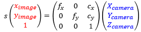
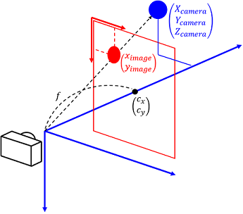

# カメラ校正とは？

カメラ校正は、**カメラ画像中での位置と現実世界での位置を対応付ける**ための情報を取得する作業です。このページでは、カメラ校正で何をやっているのかの概念といくつかの注意点を説明します。  

MocapForAllのカメラ校正では、下記の二つの情報を取得します。

- 内部パラメータ（カメラ自体の特徴）
- 外部パラメータ（カメラの実世界での位置）

## 内部パラメータとは

カメラのレンズの焦点距離 *f* および光軸の位置 *Cx, Cy* といった、**カメラそれ自体の特徴**を表す情報です。  
これはカメラ（とレンズ）に固有のもので、基本的に変化しません。そのため、**一度正しく取得すればそれ以降は再取得は不要**になります。  

!!! Warning "オートフォーカスについての注意"
    オートフォーカスが入っているカメラは、フォーカスが変化すると焦点距離が変わってしまうため、内部パラメータも変わってしまうことに注意してください。  
    経験的には、一般的な携帯電話のレベルのオートフォーカスではいちいち内部パラメータの再取得をせずとも問題になることはないですが、もし高い精度が出ない場合はカメラのオートフォーカスを疑う必要があるかもしれません。  

!!! Question "数学的表現"
    数学的には、「カメラ画像中の座標」と「カメラ座標系での座標」の関係を記述する行列で表されます。アプリ画面上に表示されているのはこの値です。  

    { loading=lazy }  

    { loading=lazy }

## 外部パラメータとは

カメラが現実世界のどこにあってどういう向きを向いているかという、**カメラの実世界での位置**を表す情報です。  
原理的には、カメラを部屋の中で完全に固定してしまえば変化しないものとして扱うことができますが、カメラを固定したつもりでも**時間の経過とともに少しずつずれることがあるため、基本的には使用開始時に毎回再取得**することをお勧めします。  

!!! Question "数学的表現"
    数学的には、「カメラ座標系での座標」と「世界座標系での座標」の関係を記述する行列で表されます。アプリ画面上に表示されているのはこの値です。

    { loading=lazy }  

    { loading=lazy }

## 外部パラメータの取得の4つの方式

MocapForAllでは、外部パラメータの取得には下記の4つのやり方があります。それぞれ、準備と実施方法が異なるので注意してください。

|  やり方  |  精度  |  手軽さ  |  使える空間の大きさ  | 　評価  |
| ---- | ---- | ---- | ---- | ---- |
|  1. ChArUcoボードを使うやり方 |  ◎  |  △  |  △  | 一番精度が出ますが、準備にちょっとした工作が必要になる方式です。**長期的にはこのやり方が一番楽だと思います。** |
|  2. ArUcoクラスターを使うやり方   |  ○  |  ○  |  ○  | 精度と準備の手軽さを兼ね備えた方式です。**はじめての人は、まずはこのやり方で試してみることをお勧めします。** |
|  3. Diamondクラスターを使うやり方 |  ◎  |  ×  |  ◎  | 準備が大変ですが、複数のマーカの相対位置を別途測定することにより、多数のカメラで広範囲をキャプチャをしたい場合などに使えるやり方です。 |
|  4. 人の動きを使うやり方    |  △  |  ◎  |  ○  | マーカを印刷できない、あるいは、マーカの設置に適さない環境（例えば野外）でキャプチャをする場合に使えるやり方です。 |