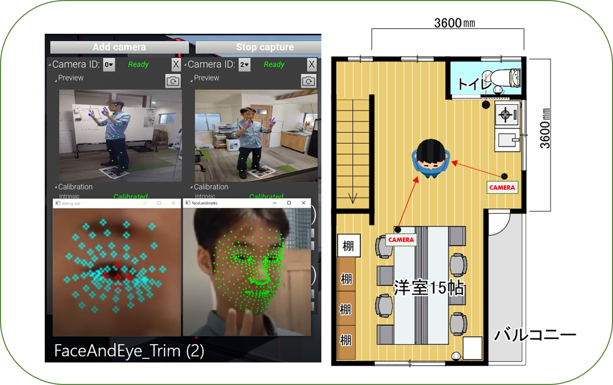

# カメラの用意
MocapForAllがインストールされたPCに接続可能なWEBカメラやスマートフォンをご用意ください。  
スマートフォンを使用する場合は[DroidCam](https://www.dev47apps.com/)や[Iriun](https://iriun.com/)など、スマートフォンをPCのWebカメラとして利用できるアプリをご利用ください。  

## どんなカメラがいいの？
### ウェブカメラ or スマホ
ウェブカメラとスマートフォンどちらがより精度が高い等のデータはありません。お手元の機材を実際に接続して確認するのが一番です。  
スマートフォンなどのバッテリー駆動の機材を使用する際は、バッテリー切れにご注意ください。  
なお、MocapForAllの公式からの動画は、有線のカメラを使用していると明記しているもの以外は、すべてスマホとタブレットを無線で接続して動作させています。

### 有線 or 無線
MocapForAllのキャプチャ結果は、現実の人の動きに対して遅延します。その遅延の大部分は、カメラ画像がPCに転送されるのに要する時間です。  
有線カメラの方が無線カメラより遅延が小さいことが多いです。また、スマートフォンをWebカメラ化するアプリや仮想カメラを使用すると、遅延が大きくなる傾向にあることに注意してください。  
VR機器と組み合わせて使用する場合、遅延ができるだけ小さくなるように構成するのがおすすめです。

### 視野角、FPS、画像サイズ
それぞれ推奨値は設けておりませんが、参考までに以下をご確認ください。  

- **視野角**は広い方がモーションキャプチャできる空間を広く確保できます。しかし、MocapForAllではシンプルなピンホールカメラモデルで三次元位置を計算しているため、魚眼レンズのように画像に歪みが生じると動きを正しくキャプチャできません。歪みが少なく、視野角の大きいカメラが最も適しているといえます。参考までに、例えば視野角120°のウェブカメラで適切に動作しているという報告がいくつか上がっています。   
- **フレームレート**が低い場合、その値がキャプチャ結果のフレームレートのボトルネックとなり得ます。使用するPCの性能を勘案した上で、ご自身が目標とされるキャプチャ結果のフレームレート以上のカメラをご用意ください。なお、MocapForAll自体の処理能力は、例えばGTX1080Tiを使う場合、MocapForAll単独で動作させて60fps、VRと同時に使用して20fps程度が目安です。   
- **画像サイズ**は、体の動きのキャプチャの精度にはあまり寄与しません。640x480ピクセル程度で十分です。というのも、内部の処理で、人のいる領域の画像を切り抜いたあと256x256ピクセル等に縮小してAIへのインプットとしているためです。ただし、手や顔のキャプチャも行う場合は、同様の処理を手や顔という小さな領域に対して行うため、画像サイズ（と解像度）が大きい方が精度が向上します。私たちは通常HD程度の画像サイズのカメラを使用しています。

## どんなカメラ配置がいいの？
下記を踏まえた上で、最低2台のカメラに同時に全身が映る位置へカメラを設置する必要があります。  

### 垂直方向：胸～目線の高さ
カメラを設置する高さはキャプチャ対象の胸～目線の高さをおすすめします。  
極端に見上げる・見下げる設置となる場合キャプチャの精度が下がる傾向があります。   

### 水平方向：正面左右45°+α
カメラの水平方向の位置は、キャプチャ対象正面からそれぞれ45°程度の角度をつけての設置がおすすめです。  
キャプチャ対象と2つのカメラが一直線上に位置してしまうと奥行方向の情報が不足し精度が下がる傾向があります。  
参考として我々が設置しているカメラの位置をご紹介します。  

  { loading=lazy }

## カメラ台数と精度、負荷
カメラの台数を増やすことでキャプチャ対象の死角が減るため、精度（というより正確度）の向上が期待できます。しかしこれについての定量的なデータはありません。  
カメラ台数にほぼ比例してPCへの負荷も上昇するため、カメラを増やすとPCのスペックによってはキャプチャ結果のフレームレートが低下します。  
まずはカメラ2台での運用から始め、死角によって問題が生じることがわかった場合にカメラの追加を検討することをおすすめします。  

（例: 4カメラと2カメラの比較）  
<blockquote class="twitter-tweet">
カメラ４台での実行結果です。アプリケーションとしては、カメラの台数に上限を設けていません。ただし、カメラ数に比例して処理負荷が増大するため、どこまで増やせるかはPCのスペックに依存します。 ↓ カメラ2台 ↓<a href="https://t.co/cCG3Le6t9a">https://t.co/cCG3Le6t9a</a> <a href="https://t.co/9r3CjP23Bl">pic.twitter.com/9r3CjP23Bl</a>
&mdash; 空き家総研VRラボ -Akiya Research Institute,VRlab- (@Akiya_Souken_VR) <a href="https://twitter.com/Akiya_Souken_VR/status/1397121208257110019?ref_src=twsrc%5Etfw">May 25, 2021</a></blockquote> 