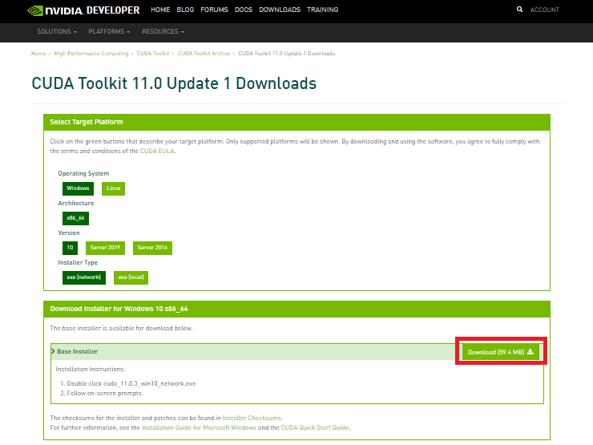
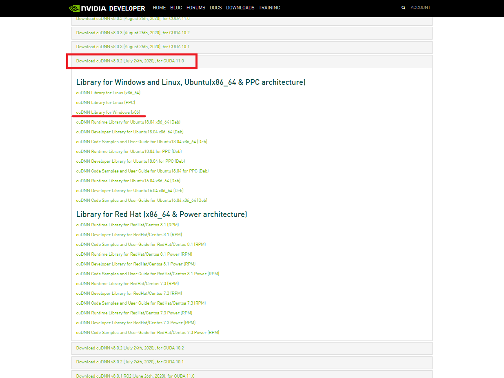
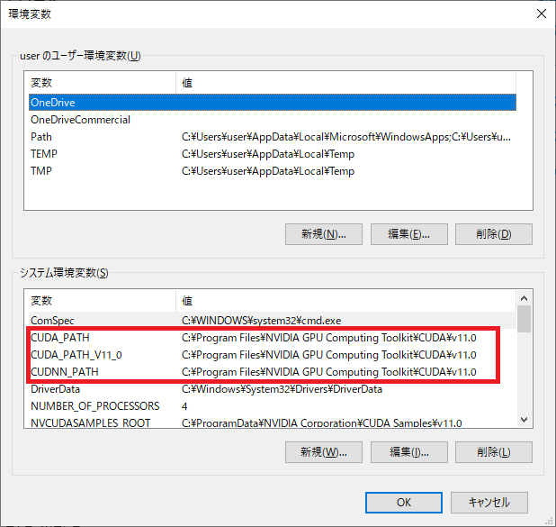
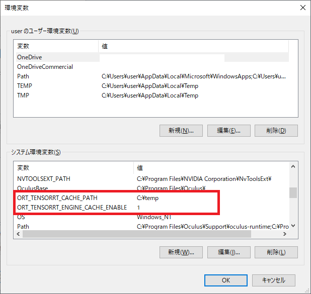
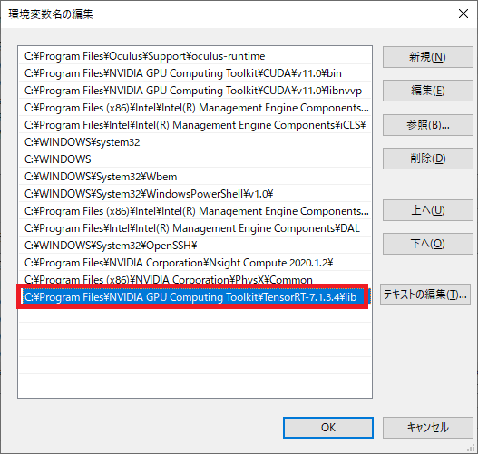

# TensorRTのインストール

!!! Info "このページはスキップ可能です"
    TensorRTを使用しない場合は、このページの内容はスキップしてください。

このセクションは、1ms/フレームでもパフォーマンスを向上させたいガチ勢のみを対象としています。  
（例えば開発環境のGTX1080Tiだと、TensorRTはDirectMLに比べてPrecisionモードで 約1ms/フレーム/カメラ だけ優れた性能を発揮します）  
CUDA、cuDNN、TensorRTをサポートするNvidia製のGPUが必要です。  
RTX30**シリーズとそれ以外で、下記の通り、使用するcuDNNとTensorRTのバージョンが異なることにご注意ください。    

|              | RTX30**シリーズ以外                     | RTX30**シリーズ                       |
| ------------ | --------------------------------------- | ------------------------------------------ |
| **CUDA**     | 11.0.3                                  | 11.0.3                                     |
| **cuDNN**    | v8.0.2 (July 24th, 2020), for CUDA 11.0 | v8.0.5 (November 9th, 2020), for CUDA 11.0 |
| **TensorRT** | 7.1.3.4 for CUDA 11.0                   | 7.2.2.3 for CUDA 11.0                      |

!!! Note "謝辞"
    RTX30**シリーズ向けのバージョンは、[漆原 鎌足](https://twitter.com/kamatari_san/status/1435536643901902852)さまから情報提供いただきました。ありがとうございます！

!!! Warning "RTX2080Tiユーザの方へ"
    RTX2080Tiを使っている場合は、cuDNN v8.0.5を使う必要があるかもしれません。下記の組み合わせをいろいろ試してみてください。 

!!! Warning "RTX30**シリーズのユーザの方へ"
    RTX30**シリーズについては、RTX3060Ti と RTX3070 でのみ動作を確認しています。それ以外での動作は未検証です。（動いたよ！という方はぜひご一報ください）

これ以降、RTX30\*\*シリーズ**以外**の場合について説明します。RTX30\*\*シリーズを使用する場合は、適宜バージョンを読み替えてください。

1. 「CUDA11.0.3」を「[こちら](https://developer.nvidia.com/cuda-11.0-update1-download-archive?target_os=Windows&target_arch=x86_64&target_version=10&target_type=exenetwork)」からインストールします。  
    インストーラーがNVIDIAドライバーのインストールに失敗する場合があることに注意してください。その場合は、最新のNVIDIAドライバーを手動でインストールしてください。 

    { loading=lazy }

2. 「cuDNN v8.0.2 (July 24th, 2020), for CUDA 11.0」を「[こちら](https://developer.nvidia.com/rdp/cudnn-archive)」からダウンロードして展開（解凍）します。　 

    { loading=lazy }

3. 展開されてできた、  
    
    * cudnn-11.0-windows-x64-v8.0.2.39\cuda\bin
    * cudnn-11.0-windows-x64-v8.0.2.39\cuda\include
    * cudnn-11.0-windows-x64-v8.0.2.39\cuda\lib  

    の3つのフォルダをコピーして、「C:\Program Files\NVIDIA GPU Computing Toolkit\CUDA\v11.0」へ貼り付け下記同名フォルダを上書きします。

    * C:\Program Files\NVIDIA GPU Computing Toolkit\CUDA\v11.0\bin
    * C:\Program Files\NVIDIA GPU Computing Toolkit\CUDA\v11.0\include
    * C:\Program Files\NVIDIA GPU Computing Toolkit\CUDA\v11.0\lib  
        
4. システム環境変数に、変数名「CUDNN_PATH」を新規で追加し、その際に変数値を「C:\Program Files\NVIDIA GPU Computing Toolkit\CUDA\v11.0」に設定します。  
    
    !!! Info "環境変数の追加方法"
        システム環境変数は、「スタートメニュー→設定→システム→詳細情報→関連設定：システムの詳細設定→環境変数」で、新規追加が可能です。  
 
5. 「TensorRT7.1.3.4」を「[こちら](https://developer.nvidia.com/nvidia-tensorrt-7x-download)」からダウンロードして展開（解凍）します。  
    ※NVIDIAアカウントが必要です。 
    { loading=lazy }

6. 上記Zipを展開したフォルダの中のlibフォルダを環境変数「Path」に編集で変数値を新規で追加します。  
    （変数値例：「C:\Program Files\NVIDIA GPU Computing Toolkit\TensorRT-7.1.3.4\lib」）  

7. システム環境変数に、変数名「ORT_TENSORRT_ENGINE_CACHE_ENABLE」を新規で追加し、その際に変数値を「1」に設定します。   

8. システム環境変数に、変数名「ORT_TENSORRT_CACHE_PATH」を新規で追加し、その際に変数値をキャッシュファイルを保存する任意のパス（「C:\temp」など）に設定します。）  
    
    !!! Question "TensorRTのオプション"
        TensorRTのオプションの詳細については、「[こちら](https://www.onnxruntime.ai/docs/reference/execution-providers/TensorRT-ExecutionProvider.html#configuration-options)」を参照してください。  

    （環境変数は下記のようになります。）  
    { loading=lazy }    
    { loading=lazy }  
​    （環境変数「Path」は下記のようになります）  
    { loading=lazy }  
