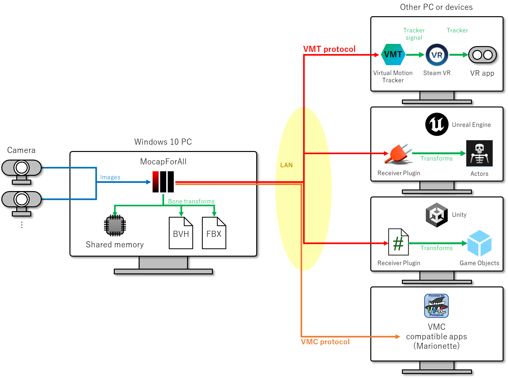

# MocapForAllって何？

## 万人のためのモーションキャプチャシステム
{ loading=lazy }

#### 特別な装置不要

下記のものがあれば、人の動きをキャプチャすることができます。

- ミドルクラスのPC
- 2台以上のウェブカメラ
- 2.5m x 2.5mくらいの空間

ウェブカメラはウェブ会議で使用するような一般的なものを使用できます。またスマートフォンやタブレットをウェブカメラ化するアプリを利用することもできます。

#### ミドルクラスのPCでリアルタイム
例えば、専用のGPUを持たない Surface Pro 7 で 17fps前後、GTX1080Ti なら 30～60fpsで動作させることができます。

#### 安い
予算が限られているインディーズでの製作活動、教育目的や社内での利用などに選択肢として加えることができます。	

## MocapForAllでできること
- キャプチャ結果をVMTプロトコル(※1) および [VMCプロトコル](https://protocol.vmc.info/)(※2) でネットワーク上に(※3)リアルタイムで出力することができます。
- キャプチャ結果をBVH形式のファイルに保存することができます。
- キャプチャ結果を共有メモリにリアルタイムで出力することができます。

!!! Note
    ※1 ここでの「VMTプロトコル」とは、[Virtual Motion Tracker](https://gpsnmeajp.github.io/VirtualMotionTrackerDocument/) の通信で使用されるメッセージのフォーマットを指します。Virtual Motion Trackerの公式HPでは「VMTプロトコル」という呼称は用いられていませんが、MocapForAllでは便宜上「VMTプロトコル」という呼称を使用しています。  

    ※2 VMCプロトコルは、[VirtualMotionCapture](https://vmc.info/)に代表されるアプリケーションでの通信に用いられるメッセージのフォーマットです。MocapForAllを含むVMCプロトコルに対応したその他のアプリケーション間での通信には、VirtualMotionCaptureそれ自体は必須ではないことに注意してください。

    ※3 VMTプロトコルもVMCプロトコルも、UDP/OpenSound Controlにより通信を行います。

これらにより下記に述べるような利用が可能であるとともに、いずれの出力仕様も公開されたものであるため、自身で受信側のプログラムを製作することも可能です。

{ loading=lazy }

### Virtual Motion TrackerによるSteamVR連携

[Virtual Motion Tracker](https://gpsnmeajp.github.io/VirtualMotionTrackerDocument/)を介して、キャプチャ結果を仮想トラッカーとしてSteamVRで動作するアプリケーションで使うことができます。

### UE4, UE5, Unityへのデータ連携

Unreal Engine 4, Unreal Engine 5, Unityへキャプチャ結果を送信し、ゲーム開発や映像製作に利用することができます。   

- VMTプロトコルを用いて、（Virtual Motion TrackerとSteamVRは使わずに）UE4, UE5, Unityへ直接データを連携するためのプラグインを[こちら](https://booth.pm/ja/items/3026430)で公開しています。
- [VMCプロトコルによるアプリ連携](#vmcプロトコルによるアプリ連携)に記載の通り、VMCプロトコルを用いて、EVMC4UやVMC4UEによる連携も可能です。
- 共有メモリを経由して、Unityへデータを連携するためのサンプルプロジェクトを[こちら](https://github.com/Akiya-Research-Institute/MocapForAll-SharedMemory-Plugin-for-Unity)で公開しています。

### VMCプロトコルによるアプリ連携

VMCプロトコルを用いて、様々なアプリケーションに情報を連携することができます。動作確認済みのアプリケーションは下記の通りです。

- [VSeeFace](https://www.vseeface.icu/)へのボーンの送信、VSeeFaceからの表情モーフの受信
- [EVMC4U](https://github.com/gpsnmeajp/EasyVirtualMotionCaptureForUnity)へのボーンと表情モーフの送信
- [VMC4UE](https://github.com/HAL9HARUKU/VMC4UE)へのボーンと表情モーフの送信
- [VMC4B](https://tonimono.booth.pm/items/3432915)へのボーンの送信
- [VirtualMotionCapture](https://vmc.info/)へのトラッカーの送信

### BVH形式での書き出し

BVH形式ファイルでキャプチャ結果を保存することができます。Blender等で利用できます。