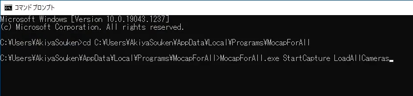

# その他

## キャラクターへの視点の追随

- 「Settings > General > Look at character」をオンにすると、視点がキャラクターの動きに追随します

## トラッキング位置の表示・非表示

- 「Settings > General > Draw tracking points」で、トラッキング位置を表す黄色い四角形の表示をオンオフできます

## 言語

- 画面右上の地球のアイコンから、使用する言語を設定できます。現状、日本語、英語、フランス語に対応しています。

## 設定のリセット

すべての設定をリセットするには、「C:\Users\【ユーザ名】\AppData\Local\MocapForAll」を削除します。  
MocapForAllが何らかの原因で起動しなくなった場合、設定をリセットすると起動することがあります。

## 起動時にコマンドライン引数で動作を指定する

下記の語句を引数に指定することで、起動時に特定の動作を実行させることができます。  

- 「StartCapture」： 起動直後に「Start Capture」ボタンを押したときと同じ動作をします。
- 「LoadAllCameras」： 起動直後に「LoadAllCameras」ボタンを押したときと同じ動作をします。

使用例：

{ loading=lazy }

## 上半身のみへのモーション適用

下記の設定により、キャラクターの上半身のみにモーションを適用するようになります。

- "Settings > General > Capture body > Apply to lower body" をオフにする。

下半身は前フレームの位置で停止するので、必要に応じて "Settings > Coordinates" で上半身と下半身の相対位置を調整してください。  
なお、内部の処理としては単に下半身へのモーションの適用を停止しているだけです。